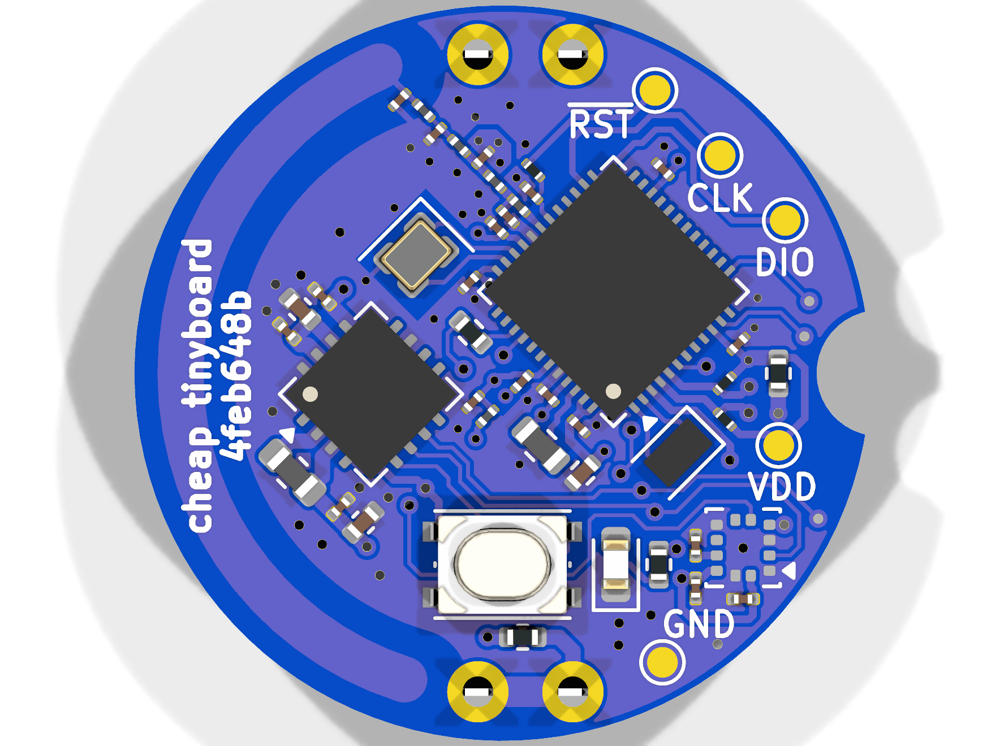

# TinyCoinCell

TinyCoinCell is a compact KiCad reference design for a coin-cell powered
Nordic beacon built around the nRF54L15, optional nPM2100 primary-cell PMIC,
and an ADXL367 accelerometer.

## Hardware

- nRF54L15 low-power Bluetooth LE 6 SoC, 1.5 MB NVM, 256 KB RAM, Arm Cortex-M33,
  and RISC-V coprocessor
- Optional nPM2100 primary-cell PMIC with fuel gauge and hibernate support
- ADXL367 ultralow-power accelerometer on I2C
- CR2032 battery holder
- User button and user LED
- SWD programming pads and UART breakout pads
- 32 MHz HF crystal and 32.768 kHz LF crystal

## Assembly Variants

| Variant | Populate | Do not populate | Notes |
| --- | --- | --- | --- |
| `nPM2100` | `U8`, `C44-C47`, `C49`, `L6`, `R3` | `R4`, `R7` | Button is connected to the nPM2100 ship-button input. The host can observe it through `nPM2100.GPIO0` on `P1.05`. |
| `No nPM2100` | `R4`, `R7` | `U8`, `C44-C47`, `C49`, `L6`, `R3` | Battery powers the board directly and the user button is connected to `P1.11`. |

Both variants omit the test pads from production placement files. The KiCad
variants also override `R5` and `R6` to `4.7kR`.

## Pinout

| Function | nRF54L15 pin |
| --- | --- |
| User LED | `P1.02` |
| I2C SDA | `P1.03` |
| I2C SCL | `P1.04` |
| nPM2100 GPIO0 | `P1.05` |
| User button, no-nPM2100 variant | `P1.11` |
| UART TX | `P2.00` |
| UART RX | `P2.02` |

This project uses symbols and footprints from
[nordic-lib-kicad](https://github.com/hlord2000/nordic-lib-kicad)

## Release Artifacts

The `v2` release is built from the contents of the local `build/` directory.
It includes the rendered board images, schematic PDF, STEP model, Gerbers, BOMs,
placement files, KiCad ERC/DRC reports, and the generated design-review bundle.
